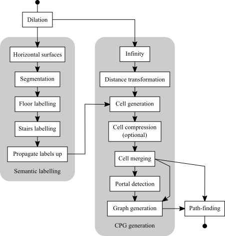

# MSc Geomatics thesis: 3D path-finding in a voxelized model of an indoor environment 

## Synopsis
This repository contains 14 programmable filters for [ParaView](http://www.paraview.org). These filters should be executed in consequtive order to enable hierarchical path-finding in a model of an indoor environment. The path-finding method supports different kinds of actors by incorporating their size (width & height) and mode of locomotion (drive, walk, fly). The input model is decomposed into a cells and a graph is derived from this cell decomposition. Path-finding is then performed on two levels: first in the graph and then in the cell decomposition. 

### Required input model

The input model has to be a vtkImageData (file extension .vtk or .vti). Empty space has value 0 and non-empty space has value > 0.

## Usage

The entire methodology involves 4 steps. The first 3 steps have to be performed only once while the 4th step - the actual path-finding - can be performed multiple times.

1. Dilation the input model
2. Semantic labelling of the dilated model
3. Cell-and-portal graph (CPG) generation
4. Hierarchical path-finding

### 1. Dilation of the input model
The size of the actor is incorporated by dilating the input model.
The input model is dilated by creating a horizontal buffer around the geometry and extruding the geometry downwards. 
The radius of the buffer should be half the diameter of the actor and the downward extrusion should be the height of the actor - 1.

Define variables: *radius* and *vertical_extrusion*

Run script: *1_dilate.py*

### 2. Semantic labelling of the dilated model
Distinction between the three different modes of locomotion (drive, walk, fly) is made by constructing the correct navigable spaces.
Driving actors are only capable of navigating over flat floors, walking actors are also capable of navigating over stairs and flying actors are also capable of navigating over obstacles. Next to that, walking and driving actors are bound to a ground surface while a flying actor can freely move up and down. It is therefore required that the space is semantically labelled by one of the following classes: floor (1), stairs (2) or obstacle (3).

Semantically labelling of the dilated model involves 5 steps:

1. Extraction of horizontal surfaces
2. Segmentation of horizontal surfaces
3. Selection of floor segment
4. Labelling stairs by slope estimation
5. Upwards propagation of labels

#### 2.1. Extraction of horizontal surfaces
Run script: *2_1_horizontal_surfaces.py*

#### 2.2. Segmentation of horizontal surfaces
Run script: *2_2_segmentation.py*

#### 2.3. Selection of floor segment
Run script: *2_3_floor_labelling.py*

#### 2.4. Labelling stairs by slope estimation
Run script: *2_4_stairs_labelling.py*

#### 2.5. Upwards propagation of labels
Run script: *2_5_propagate_labels_up.py*

### 3. Cell-and-portal graph (CPG) generation

Cell-and-portal graph (CPG) generation involves two steps:

1. Cell generation and portal detection
2. Graph generation

#### 3.1. Cell generation and portal detection

[Volumetric Cell-and-Portal Generation](https://hal.inria.fr/inria-00510188/file/mcp.pdf)

#### 3.1.1. Assigning infinity to empty space
Run script: *3_1_infinity.py*

#### 3.1.2. Distance transformation
Run script: *3_2_distance_field.py*

#### 3.1.3. Generating cells
Run script: *3_3_cells*

#### 3.1.4. Compressing cells
Run script: *3_4_compress_cells*

#### 3.1.5. Merging cells
Run script: *3_5_merge_cells*

#### 3.1.4. Detecting portals
Run script: *3_6_portals*

### 3.2. Graph generation

[Near Optimal Hierarchical Path-Finding](https://webdocs.cs.ualberta.ca/~mmueller/ps/hpastar.pdf)

Run script: *3_7_graph*

## 4. Hierarchical path-finding

Script: *4_path*

Pparameters: xx

Inputs: graph, cells, start position (ProbeLocation), end position (ProbeLocation)

